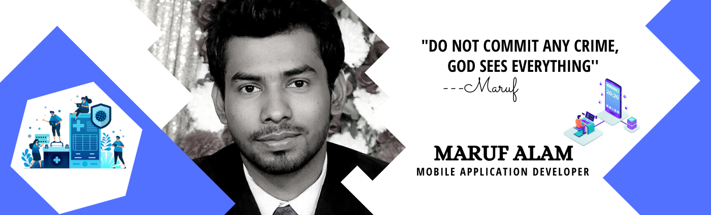
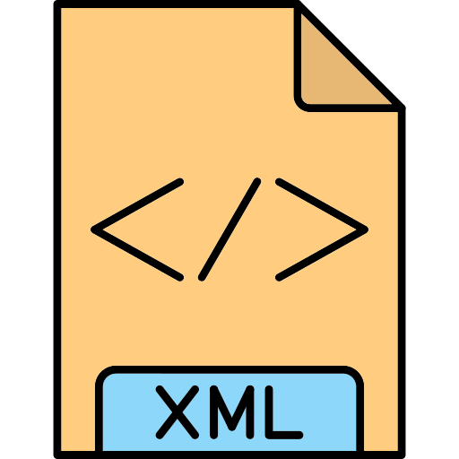
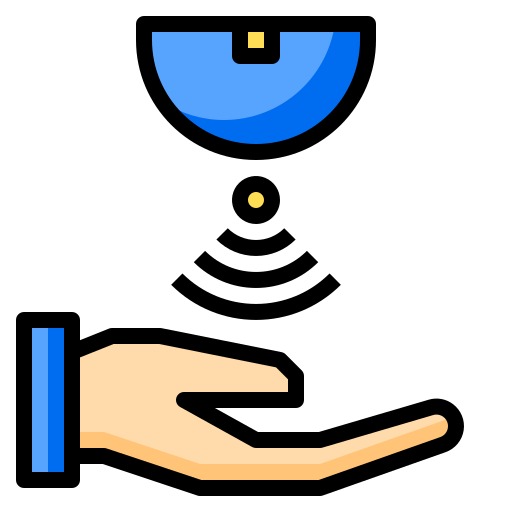
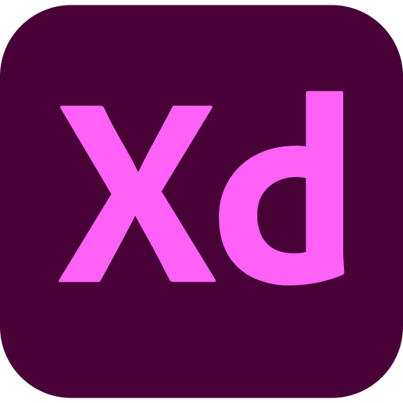

<!-- banner image starts here  -->

<!-- banner image ends here  -->

<h1> 👋 Hello, I'm Maruf Alam </h1>

  

<!-- Place this tag where you want the button to render. -->
<a class="github-button" href="https://github.com/AppsDevMaruf" data-color-scheme="no-preference: light_high_contrast; light: dark; dark: dark_high_contrast;" data-size="large" data-show-count="true" aria-label="Follow @AppsDevMaruf on GitHub">Follow @AppsDevMaruf</a>

I am a Mobile Application Developer And Content Creator  
🏠 &nbsp; Living: Bashundhara RA, Dhaka-1229  
### 📫 &nbsp;  How To Reach Me **marufalam120@gmail.com**

<!-- Contact me section starts here  -->

[][website]
[][gmail]
[][youtube]
[][facebook]
[][linkedin]
 
 

<!-- Contact me section ends here  -->

<!-- about-me section starts here  -->

### 👨‍🏫 &nbsp; About Me

Hi guys! This is me Maruf Alam Porosh. I am an experienced Mobile Application Developer with 3+ years of hands-on experience in the Mobile Apps Industry.

 
<!-- about-me section ends here  -->

<!-- web related skills section starts here  -->

### 👨🏽‍💻 &nbsp; My Skills :

#### Key Skills

 
 
 

 
 
 

<!-- web related skills section ends here  -->
<!-- other skills and my videos for computer science section starts here  -->

#### Other Skills & Videos:

 
 
 

  <!-- other skills and my videos for computer science section ends here  -->

   
   
   

<!-- github stats starts here  -->

<!--  -->

 

<!-- github stats ends here  -->
  <!-- latest youtube videos starts here -->
 
### 🎬 &nbsp; Apps Presentation

↪️ &nbsp; [search more videos...](https://www.youtube.com/c/MarufAlamPorosh/l)

 

<!-- latest youtube videos ends here -->

<!-- other skills and my videos for computer science section starts here  -->

<!-- work experience section starts here  -->

### 💼 &nbsp; Employment History

| Position            | Institute                                   | Duration            | Location           |
| ------------------- | ------------------------------------------- | ------------------- | ------------------ |
| Android developer   | Hamdard University Bangladesh | On Going | Dhaka, Bangladesh |

 
<!-- work experience section ends here  -->
<!-- education section starts here  -->

### 👨🏻‍🎓 &nbsp; Education

1. B.Sc. in Computer Science & Engineering  
   Daffodil International University
     Dhaka, Bangladesh.
3. Higher Secondary Certificate (HSC)  
    Khilgaon,Dhaka-1219  
 

 

<!-- education section ends here  -->

<!-- my languages section starts here  -->

### Languages:

- 🇧🇩 Bangla : Native
- 🏴󠁧󠁢󠁥󠁮󠁧󠁿 English : Communication
- 🇮🇳 Hindi : Intermediate
   

<!-- my languages section ends here  -->

<!-- my sports and game section starts here  -->

### Sports / Game / Activities / Hobby:

- 🏏 Cricket, ⚽ Football, 🏸 Badminton
- 🏊‍♂️ Swimming, 🏃‍♂️ Running, 🚶‍♂️ Walking
- ✈️ Travelling
- 🎥 Video Editing

 
<!-- my sports and games section ends here  -->

<!-- Honors & awards section starts here  -->

### 🏅Licenses & Certifications :

- Android Application Development - Creative It 
 
 

-Professional Android Application Development - PencilBox Training Institute

---
 
Thanks for going through my Portfolio.
All rights reserved by Maruf Alam @2022

---

<!-- my achievement section ends here  -->

<!-- Links section starts here -->

[website]: http://www.marufalam.com/
[gmail]: https://mail.google.com/mail/ca/u/0/#inbox/141b796e773c4f19
[youtube]: https://www.youtube.com/c/MarufAlamPorosh/
[facebook]: https://www.facebook.com/marufalam.porosh.90/
[linkedin]: https://www.linkedin.com/in/devmarufalam/
[github]: https://github.com/marufalam120

<!-- web related playlists ends here  -->

<!-- cse related playlists starts here  -->

<!-- cse related playlists ends here  -->

<!-- Links section ends here -->

